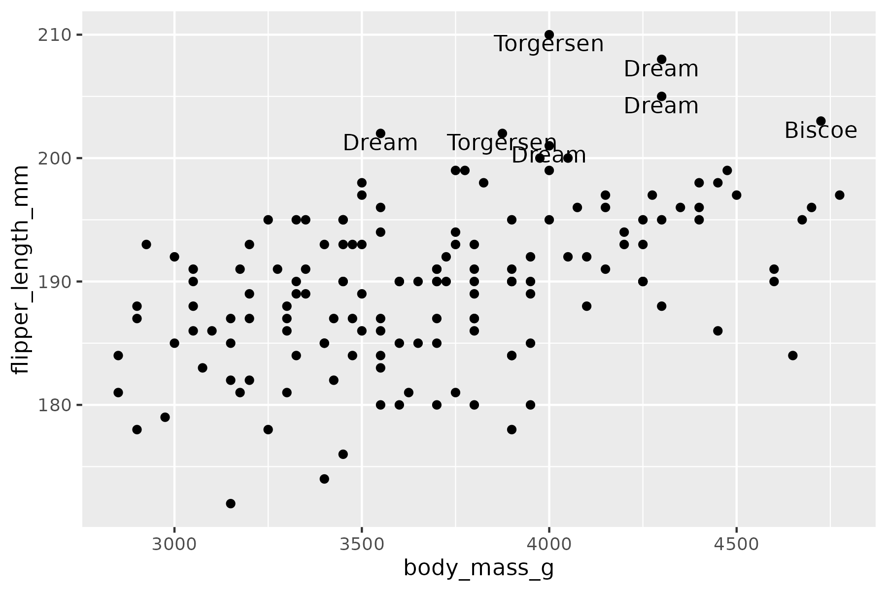
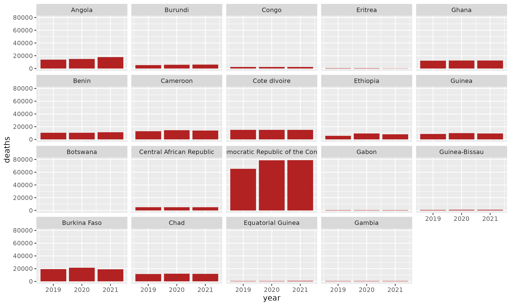
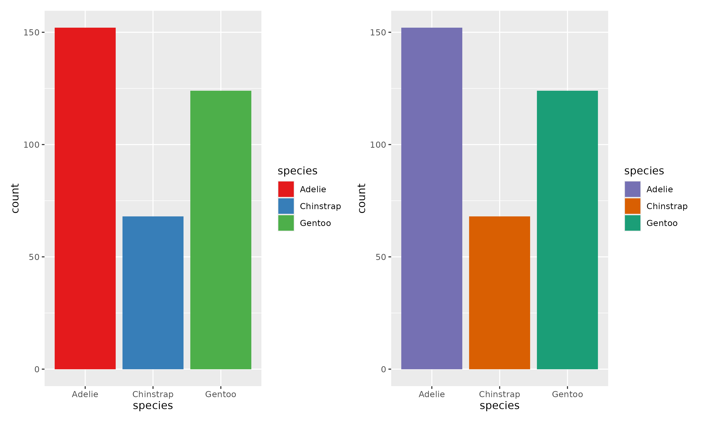
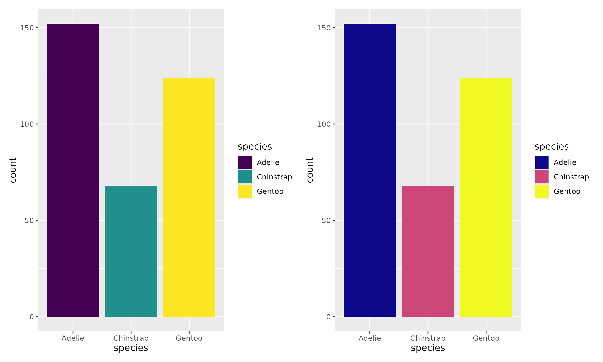
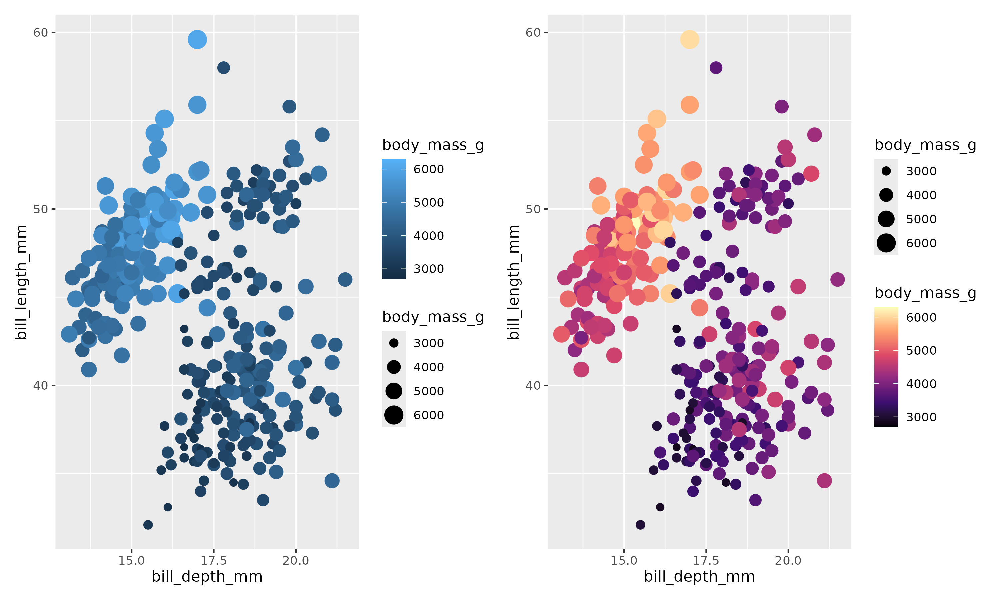
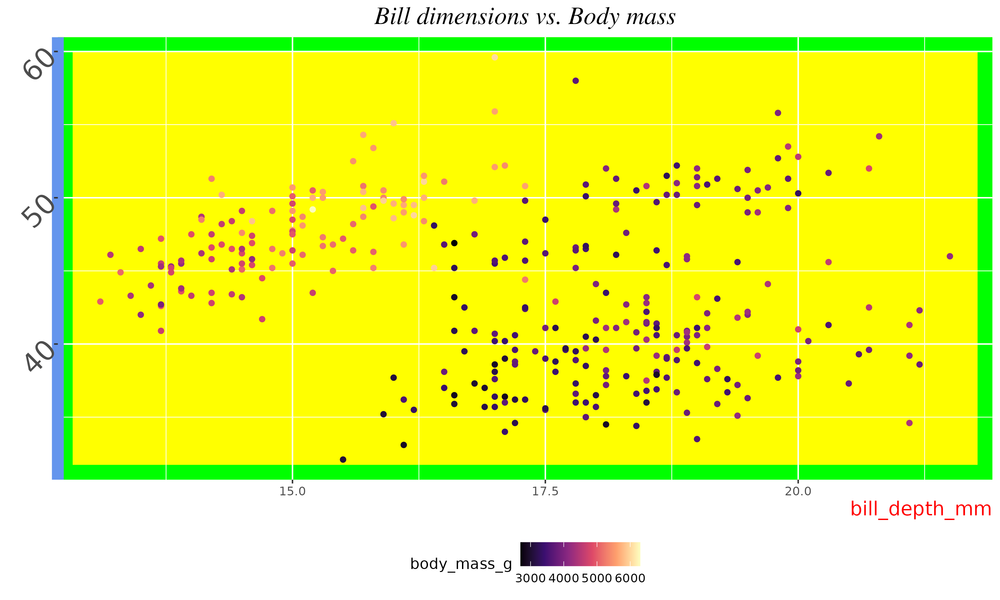
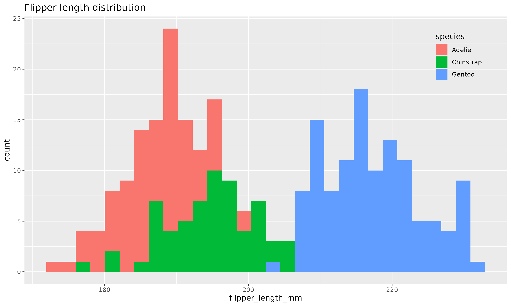

# **Coding and Data Science Project**

As part of my BIO319 module during my third year studying Biology at Queen Mary University of London, I learnt the fundamental coding principles, tidying and foramtting data as well as creating informative visualisations.

## Data
The data used in this project was provided by Queen Mary and some datasets were sourced from `dung_beetles.csv`. It contains monthly counts of various beetle species, detailing their genus and species. The dataset is of moderate size, containing columns for months and species counts. Key preprocessing steps included:
- Converting column names to lowercase.
- Removing unnecessary columns.
- Renaming certain columns for consistency.
- Reshaping the data for easier analysis.
- Splitting species names into genus and species components.

## Methodology
The analysis and visualization process involved several key steps:
1. **Data Cleaning and Preparation**: Standardised column names, removed irrelevant columns, and reshaped the dataset.
2. **Grouping and Summarizing Data**: Calculated total beetle counts for each month and analysed the distribution of species.
3. **Visualisation Techniques**: Utilised `ggplot2` for creating various plots and `patchwork` for arranging multiple plots together. Additionally, `RColorBrewer` was used to enhance color schemes in the visualisations.

The R packages used in this project include:
- `tidyverse`: For data manipulation and visualisation.
- `RColorBrewer`: For color palettes.
- `patchwork`: For combining multiple plots.

## Data Visualisation by Labelling Data Points and Maniupulating Graphic Optics - Workshop 9

The following graphs are from Workshop 9. You can find the related files in the directory: Workshop9.html and Workshop9Script.R. These plots demonstrate various data visualisation techniques using the penguins dataset and other data sources. Each image is accompanied by a description to explain the techniques and customisations applied.

### Gentoo Plot

*Description: For the Gentoo plot, we're utilizing the geom_text() function with our big_penguins dataframe. Although geom_text() is used with a different dataset, it inherits the position mappings from ggplot(), ensuring accurate label placement. To prevent labels from overlapping with the data points, we use the nudge parameters to slightly shift the labels down and to the left. Additionally, the xlim() function extends the x-axis to avoid cutting off the names, ensuring all labels are fully visible.*

### Adelie Plot

*Description: This code filters the penguins dataset to include only Adelie penguins with flipper lengths greater than 200 mm and then labels these points with their corresponding islands. The nudge_y parameter is used to slightly adjust the position of the labels.*

### Deaths by Country

*Description: In this code, the ~ operator specifies the variable used to split the data into separate plots. The ncol parameter sets the number of columns, while dir controls the wrapping direction. This approach effectively visualizes data subsets by categorical variables.*

### Penguins Plot

*Description: In this example, the plots are separated by both sex and species, creating a grid of plots that makes it easy to compare these categories against each other.*

### Combined Plot

*Description: Note that there is a new operator, %in%, in the code above. It’s extremely handy for subsetting. Here it’s used with a vector written on the fly, but you can also use a variable that contains a vector you made previously.*

### Brew Combined Plot

*Description: This image shows the application of ColorBrewer palettes to a dataset. The first plot uses a sequential palette ("Set1") suitable for ordered data, while the second plot applies a categorical palette ("Dark2") with reversed direction, demonstrating how different palette types can be used to highlight various data features effectively.*

### Viri Combined Plot

*Description: This image demonstrates the use of viridis color scales, which are designed to be color-blind friendly. The first plot uses the default "viridis" option, while the second plot applies the "plasma" option, showcasing how these palettes provide better visibility and accessibility for people with color vision deficiencies.*

### Continuous Combined Plot

*Description: This image illustrates the application of continuous color scales. The first plot uses the default color mapping for the body mass of penguins, while the second plot applies the "magma" option of the viridis scale, enhancing the visualization with a continuous color gradient that improves interpretability.*

### Bill Dimensions vs Body Mass

*Description: This image demonstrates how to customize various elements of a ggplot. It shows modifications to the axis titles, axis lines, text, panel background, and plot title, highlighting the flexibility and control available through the theme() function.*

### Flipper Length Distribution

*Description: This image illustrates how to modify the position and appearance of the legend using the theme() function in ggplot2. By placing the legend inside the plot and removing the legend background, we can save space and make the plot more compact.*

### View folder with images [here](./Images_for_Git).
